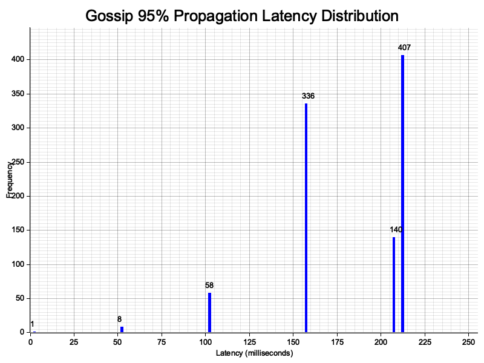

# Order propagation

## Design decisions

### Gossip protocol

It's a push-based gossip protocol working as such:

1. Node receives a packet, containing an order
2. **Duplicate handling**: Each node keeps a `HashSet<PacketId>` of already seen packets (hash set of ids for fast look up). If the packet is already seen ignore and stop. If the packet is new, add it to the set and continue.
3. Process the order. This is a PoC. So it simply stores the order. But, it could match against known orders, send the result of the match elsewhere, etc.
4. **Infinite loop prevention**: If packet's TTL is zero, stop (e.g. don't propagate further). Otherwise, decrease TTL and continue. This makes sure packets have a finite life in the network. *Note*: Initial TTL must be chosen appropriately, a TTL too small may lead to packets only reaching part of the network.
5. Select `num_peers` (configured to 8) neighbors randomly (excluding the node that sent the packet) and forward the message to them (with TTL and source_id updated).

This is a simple yet effective and robust design for simulating information propagation in the network.

Further improvements could include: pulling from nodes and having more information about who has already seen the message (to reduce duplicated packets and choose neighbors more efficiently). But these decisions and improvements will depend on the real-life application the gossip is applied to (network topology, node lifecycle, latencies, etc...).

### Serialization

For a high-frequency, low-latency networking I think the most important factors are speed and size of serialized data, in that order. Indeed, to achieve low-latency, the time to serialize/deserialize must be minimised and for high-frequency, it's better if packets are not too large to not suffer from bandwidth issues.

To choose the best serialization library, I compared two major libraries: bincode and borsh. A similar mechanism could be used to compare more of them.

The results were the following:

|     | non-empty packet serialized size | serialize + deserialize time |
| -------- | ------- | ----- |
| `bincode`  | 30 bytes    |  40.920 ns     |
| `borsh` | 42 bytes     |   24.258ns   |


I decided to use `borsh` because of its superior speed. The serialized packets are slightly larger but in this case I think this is minor. They could easily fit in TCP or UDP packets in both cases.

### Network topology

The network topology is a random graph generated at startup. It has the following parameters:

- `num_nodes`: The number of nodes (configured to 1000)
- `num_neighbors`: The number of connected nodes each node has (configured to 24). This creates a well-connected but not fully-connected graph.
- `latency_ms`: The latency in ms (configure to 50). It is a fixed latency between any two nodes. A fixed latency simplifies the analysis and makes the performance of the gossip protocol the primary variable. 

## How to run the code

The program can be run with `cargo run --release` (or `just run`). There is a config file at `config.toml` to change the various parameters.

### Interpret the output

The program prints the mean and standard deviation of the time it takes for a message to be gossiped to 95% of the nodes (the number of messages sent to the network can be changed via `num_runs` in the config). This is the primary indicator of the propagation strategy's efficiency.

Aditionally, the program will write `latency_histogram.png`, containing a histogram of the delivery latency at each node. This histogram allows to see the speed of propagation of a message in the network.

### Benchmark

To run the serialization benchmarks, run `cargo bench` (or `just bench`). The results will be printed to `stdout` and some more data (graphs for median, mean, pdf, ...) will be written to `./target/criterion`

## Results

```
latency = 50 ms
num_nodes = 1000
num_neighbors = 24
num_peers = 8

95% Propagation Time: 217.24775ms
```



### Analysis

With a perfect gossip propagation (= the only latency is network latency) to 8 neighbors, the bins for delivery latencies would look like this:

- 0 ms: 1
- 50 ms: 8
- 100 ms: 64
- 150 ms: 512
- 200 ms: 415

That is to say, only the network latency matters and every node sends to 8 new neighbors that have not seen the message (no duplicates). In that case, the program completes in 200 ms with 4 hops (4 iterations of gossip).

We can see that our results follow a similar shape, although it has more bins. The program finished in 4 hops and in 217 ms. This indicates the performance could be further improved. The 2 main differences between the perfect scenario and our results are:

1. We do not reach a perfect multiple of 8 each time (e.g. 62 in hop 2). That is because some nodes will propagate to the same node, so the number of nodes reached in a hop decreases (duplicate messages).
2. We do not reach nodes at a perfect multiple of 50 ms. That is because of the delays added by the program (handling the message, serializing, deserializing, sending the message, handling the async tasks, ...). In fact, we see that at each hop the distance from the perfect bin increases. This makes sense, at each hop we add some delays of message handling.
